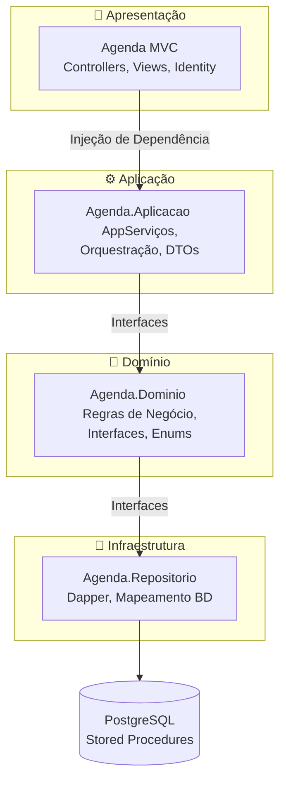
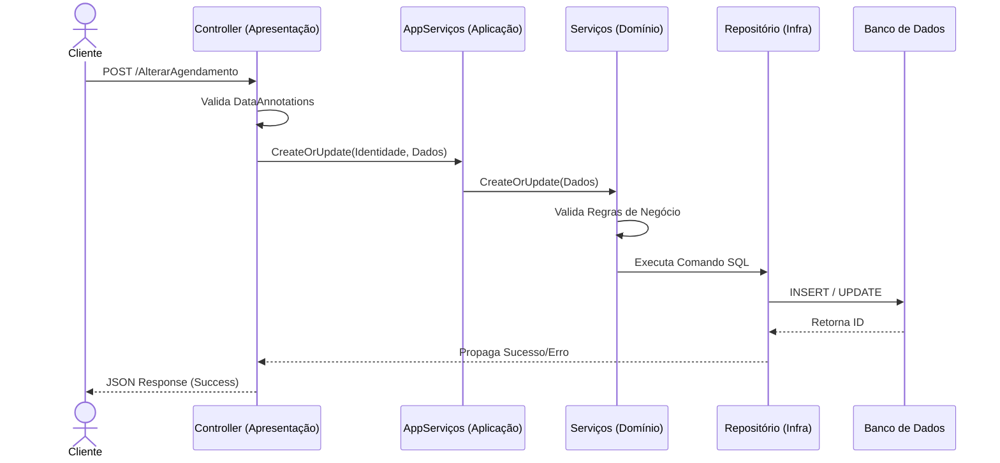
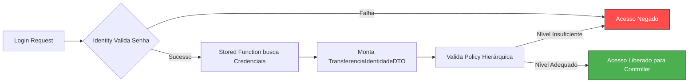

# 🏥 Agenda 2.0 - CRM Para Clínicas

## Sistema completo de CRM e gestão de agendamentos para clínicas. Desenvolvido com foco em **escalabilidade, manutenibilidade e separação de responsabilidades**, utilizando Clean Architecture (Arquitetura em 4 Camadas) e preparado para o padrão Multi-Tenant.

## ✨ Principais Funcionalidades

* 🔐 **Autenticação Segura:** Baseada em ASP.NET Core Identity com cookies criptografados.
* 🛡️ **Autorização Hierárquica:** Sistema de *Policies* em 7 níveis (User ➡️ Vendedor ➡️ Enfermeira ➡️ Gerente ➡️ Diretor ➡️ Admin ➡️ Developer). Permissões herdadas nativamente.
* 🏢 **Multi-Tenancy Integrado:** Isolamento total de dados por Empresa e Vendedor direto nas consultas ao banco.
* 📦 **Totalmente Containerizado:** Pronto para produção com Docker e Docker Compose (Build em 2 estágios).
* ⚡ **Alta Performance:** Uso estratégico do Dapper para consultas complexas (Stored Functions) e Entity Framework para Identity.

---

## 🏛️ Arquitetura do Projeto

### O projeto segue os princípios do **SOLID** e **Clean Architecture**, dividindo a aplicação em responsabilidades claras para facilitar testes e futuras manutenções ou migrações (ex: extração de microsserviços).

## 🔄 Fluxo de uma Requisição
### Como as camadas interagem na prática (Exemplo: Salvar um agendamento):

## 🛡️ Segurança e Fluxo de Acesso
### A aplicação não confia apenas em Roles estáticas. O acesso é construído através de uma injeção de dependência na classe base (BasicController), garantindo que nenhuma query seja executada sem o escopo da clínica e do usuário logado.

## 🐳 Como Rodar o Projeto (Docker)
### O projeto está configurado com docker-compose para subir tanto a aplicação (via build de 2 estágios para imagens leves) quanto o banco de dados.

### 1. Requisitos
Docker e Docker Compose instalados.

### 2. Subindo a Aplicação
Na raiz do repositório, execute:

<pre><code>
docker-compose up -d --build
</code></pre>

### Faz o build da imagem (.NET 8) e sobe os containers em background

    
### 3. Acessando
Aplicação: http://localhost:8080

### Banco de Dados (Interno): Porta 5432

## (Nota: Para rodar apontando para um PostgreSQL local na sua máquina, utilize a string de conexão referenciando host.docker.internal no docker-compose.yml).

👨‍💻 Autor
Jeferson Pimentel Sena Full Stack Engineer

💼 [LinkedIn](https://www.linkedin.com/in/jefersonsena-csharp-dotnet/)

📱 [WhatsApp](https://wa.me/71981859864/)

***

Ficou no ponto! Se você quiser que eu adicione mais alguma tecnologia específica q
